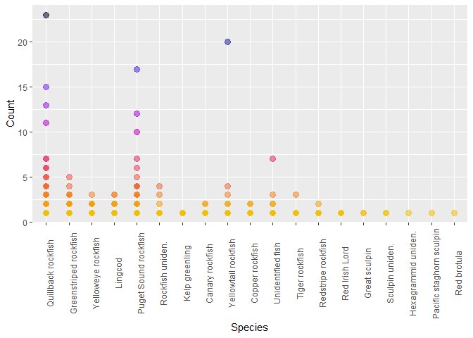

ROV fish densities
================
Fiona Francis
2/2/2021

# Preliminary Analysis of Vector ROV surveys from 2018

This includes both data cleaning and calculating abundances of fish
species and their densities using the area of transects. The goal of
this analysis is to determine if there is an effect of RCA status or
habitat type on fish densities. I think that I will need to calculate a
PCA analysis to pair down habitat characteristics into fewer categories.

SUMMARY STATS

``` r
# counts of species
fish.counts <- all.data %>% group_by(Species) %>% summarise(total = sum(Count)) %>% arrange(desc(total))
```

    ## `summarise()` ungrouping output (override with `.groups` argument)

``` r
#counts of species in and out of RCAs

all.data %>% group_by(RCA) %>% summarise(totalfish = sum(Count))
```

    ## `summarise()` ungrouping output (override with `.groups` argument)

    ## # A tibble: 2 x 2
    ##   RCA   totalfish
    ##   <chr>     <dbl>
    ## 1 IN          695
    ## 2 OUT        1479

``` r
# types of primary substrate
all.data %>% group_by(Substrate) %>% summarise(total = sum(Count))
```

    ## `summarise()` ungrouping output (override with `.groups` argument)

    ## # A tibble: 8 x 2
    ##   Substrate total
    ##   <chr>     <dbl>
    ## 1 A             4
    ## 2 B           136
    ## 3 C            61
    ## 4 H            20
    ## 5 M           866
    ## 6 P             9
    ## 7 R          1076
    ## 8 S             2

``` r
#summary of species counts by transect
all.data %>% group_by(SurveyID) %>% summarise(total = sum(Count))
```

    ## `summarise()` ungrouping output (override with `.groups` argument)

    ## # A tibble: 83 x 2
    ##    SurveyID  total
    ##    <chr>     <dbl>
    ##  1 Explore1      3
    ##  2 Explore2      8
    ##  3 Explore3      6
    ##  4 Explore4    168
    ##  5 Explore5     84
    ##  6 H010-CA-V    15
    ##  7 H011-CA-V     4
    ##  8 H015-CA-V    13
    ##  9 H016-CA-V    16
    ## 10 H017-CA-V    25
    ## # ... with 73 more rows

``` r
# counts of species
fish.counts <- all.data %>% group_by(Species) %>% summarize(total = sum(Count)) %>% arrange(desc(total))
```

    ## `summarise()` ungrouping output (override with `.groups` argument)

``` r
fish.counts
```

    ## # A tibble: 19 x 2
    ##    Species                  total
    ##    <chr>                    <dbl>
    ##  1 Quillback rockfish         822
    ##  2 Greenstriped rockfish      520
    ##  3 Puget Sound rockfish       230
    ##  4 Yelloweye rockfish         202
    ##  5 Lingcod                    161
    ##  6 Rockfish uniden.            73
    ##  7 Yellowtail rockfish         46
    ##  8 Canary rockfish             25
    ##  9 Kelp greenling              24
    ## 10 Unidentified fish           24
    ## 11 Copper rockfish             19
    ## 12 Tiger rockfish               9
    ## 13 Redstripe rockfish           7
    ## 14 Red Irish Lord               5
    ## 15 Great sculpin                2
    ## 16 Sculpin uniden.              2
    ## 17 Hexagrammid uniden.          1
    ## 18 Pacific staghorn sculpin     1
    ## 19 Red brotula                  1

EXPLORATORY PLOTTING OF ABUNDANCES

<!-- --><!-- -->

TRANSECT WIDTHS

``` r
areas
```

    ## # A tibble: 86 x 2
    ##    Survey.abbrv transect.area
    ##    <chr>                <dbl>
    ##  1 Exp1_P1               681.
    ##  2 Exp2_P1               838.
    ##  3 Exp3_P1              1146.
    ##  4 Exp4_P1              1239.
    ##  5 Exp5_P1              1681.
    ##  6 H010_P1              1372.
    ##  7 H011_P1              1472.
    ##  8 H015_P1               263.
    ##  9 H015_P2               938.
    ## 10 H016_P1              1253.
    ## # ... with 76 more rows

Species densities from all transects

``` r
# plot density against species

ggplot(fish.density) + geom_point(aes(fct_infreq(factor(Species)), density, colour = Species), size = 2, show.legend = F) +
    scale_color_fish_d(option = "Gramma_loreto", direction = -1) +  
  theme(axis.text.x = element_text(angle = 90)) +
  xlab("Species") +
  ylab("Fish per m^2")
```

    ## Warning: Removed 15 rows containing missing values (geom_point).

<!-- -->
