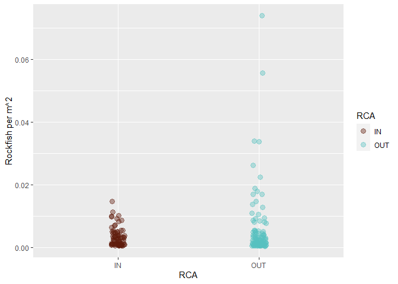
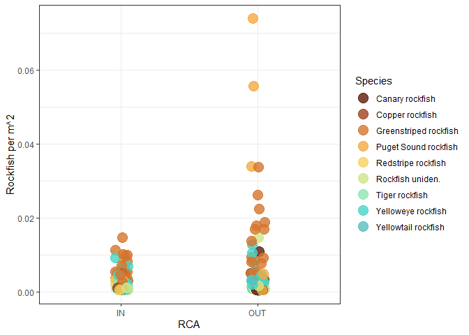
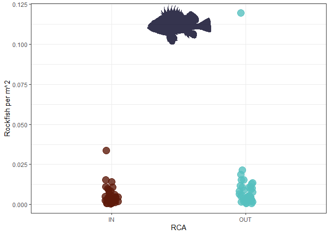
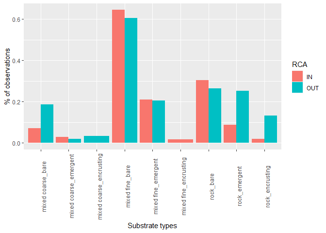
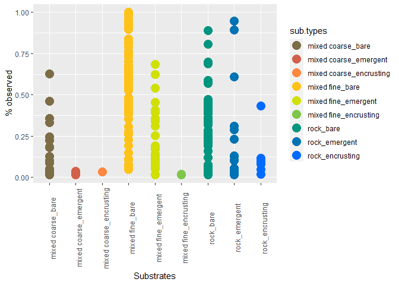

ROV fish densities
================
Fiona Francis
3/17/2021

# Preliminary analysis of fish and substrate data from 2018 ROV VECTOR surveys

The goal of this analysis is to look at the distribution of fish (all
species and specifically rockfish) along transects collected in
targetted rockfish habitat inside and outside RCAs. We want to:

1.  determine if there is an effect of RCA status on fish densities
2.  determine in there is an association between substrate types and
    fish occurrences

We currently do not have size data for the fish observations from the
stereo cameras. This data has been analyzed by WDFW but they are
currently in the field and this data during our last email communication
(Dec 2020) still needed some ground truthing.

An additional data set is in Biigle and consists of video grabs from SD,
GoPro, and stereo cameras to compare detectability between the three
types of video. These stills have been annotated but have not been sized
using laser points. I am going to talk to Jessica about exporting the
files cleanly but I (or someone) should also get sizes out of these
images so that they can be compared the the stereo data once we get it
from WDFW.

## Basic Information from SD video and fish observations


<div class="figure" style="text-align: center">


<p class="caption">

RCAs and 2018 Vector ROV transects from QGIS

</p>

</div>

Data were collected around 18 RCAS.

    ## [[1]]
    ##  [1] "Brethour,Domville,Forrest,Gooch Islands"
    ##  [2] "D'Arcy Island to Beaumont Shoal"        
    ##  [3] "South Saturna"                          
    ##  [4] "Mayne Island North"                     
    ##  [5] "Galiano Island North"                   
    ##  [6] "Valdes Island East"                     
    ##  [7] "Indian Arm - Twin Islands"              
    ##  [8] "Indian Arm - Crocker Island"            
    ##  [9] "Northumberland Channel"                 
    ## [10] "Lasqueti South -Young Point"            
    ## [11] "Lasqueti Island South"                  
    ## [12] "Davie Bay"                              
    ## [13] "Malaspina Strait"                       
    ## [14] "Sinclair Bank"                          
    ## [15] "Desolation Sound"                       
    ## [16] "Copeland Islands"                       
    ## [17] "Mitlenatch Island"                      
    ## [18] "Hardy Island"

There are 83 transects that have fish observations. There were (OUT, 43)
outside of RCAs and (IN, 43) inside RCAs collected overall. From looking
at data files such as the substrate data there are actually 88 transects
total but I think that some of these were messed up so not used. There
are two transects (H044 and H069) that I think were fine (there is width
and lenght data) but there were zero fish on them sp they do not show up
in the master fish observation csv. I have not yet put these in the
dataset but I could just creat rows with zero variable so they get
included in the model?

## BASIC DATA SUMMARIES

Total fish seen in and out of RCAs

    ## `summarise()` ungrouping output (override with `.groups` argument)

    ## # A tibble: 2 x 2
    ##   RCA   total
    ##   <chr> <dbl>
    ## 1 IN      695
    ## 2 OUT    1479

Types of primary substrate and how many times they were observed

    ## `summarise()` ungrouping output (override with `.groups` argument)

    ## # A tibble: 8 x 2
    ##   Substrate total
    ##   <chr>     <dbl>
    ## 1 A             4
    ## 2 B           136
    ## 3 C            61
    ## 4 H            20
    ## 5 M           866
    ## 6 P             9
    ## 7 R          1076
    ## 8 S             2

Number of fish seen by transect

    ## `summarise()` ungrouping output (override with `.groups` argument)

    ## # A tibble: 83 x 2
    ##    SurveyID  total
    ##    <chr>     <dbl>
    ##  1 Explore1      3
    ##  2 Explore2      8
    ##  3 Explore3      6
    ##  4 Explore4    168
    ##  5 Explore5     84
    ##  6 H010-CA-V    15
    ##  7 H011-CA-V     4
    ##  8 H015-CA-V    13
    ##  9 H016-CA-V    16
    ## 10 H017-CA-V    25
    ## # ... with 73 more rows

Number of fish of each species across all transects

    ## # A tibble: 19 x 2
    ##    Species                  total
    ##    <chr>                    <dbl>
    ##  1 Quillback rockfish         822
    ##  2 Greenstriped rockfish      520
    ##  3 Puget Sound rockfish       230
    ##  4 Yelloweye rockfish         202
    ##  5 Lingcod                    161
    ##  6 Rockfish uniden.            73
    ##  7 Yellowtail rockfish         46
    ##  8 Canary rockfish             25
    ##  9 Kelp greenling              24
    ## 10 Unidentified fish           24
    ## 11 Copper rockfish             19
    ## 12 Tiger rockfish               9
    ## 13 Redstripe rockfish           7
    ## 14 Red Irish Lord               5
    ## 15 Great sculpin                2
    ## 16 Sculpin uniden.              2
    ## 17 Hexagrammid uniden.          1
    ## 18 Pacific staghorn sculpin     1
    ## 19 Red brotula                  1

## FISH ABUNDANCES

Some basic plots pooling over all transects. You can see that certain
species were seen in clusters and others were usually solitary.

<!-- --><!-- -->

## TRANSECT AREAS

These were calculated so that we can determine fish densities per
transect. I wanted to do this by creating segments along each transect
using width measurements every 30 seconds however there were a lot of
missing values so I have done this the simple way of taking the total
distance of each transect and multiplying it by the average width pf the
lasers (width was measured every 30 seconds).

    ## # A tibble: 86 x 2
    ##    Survey.abbrv transect.area
    ##    <chr>                <dbl>
    ##  1 Exp1_P1               681.
    ##  2 Exp2_P1               838.
    ##  3 Exp3_P1              1146.
    ##  4 Exp4_P1              1239.
    ##  5 Exp5_P1              1681.
    ##  6 H010_P1              1372.
    ##  7 H011_P1              1472.
    ##  8 H015_P1               263.
    ##  9 H015_P2               938.
    ## 10 H016_P1              1253.
    ## 11 H017_P1              1323.
    ## 12 H018_P1              1324.
    ## 13 H025_P1              1457.
    ## 14 H028_P1              1076.
    ## 15 H029_P1              1554.
    ## 16 H030_P1              1369.
    ## 17 H032_P1              1610.
    ## 18 H034_P1              1603.
    ## 19 H035_P1              1570.
    ## 20 H039_P1              1534.
    ## 21 H043_P1               625.
    ## 22 H044_P1               499.
    ## 23 H045_P1              1845.
    ## 24 H046_P1              1073.
    ## 25 H052_P1              1347.
    ## 26 H055_P1               559.
    ## 27 H056_P1              1088.
    ## 28 H057_P1              1555.
    ## 29 H058_P1              1472.
    ## 30 H059_P1               957.
    ## 31 H060_P1              1795.
    ## 32 H062_P1               776.
    ## 33 H063_P1               196.
    ## 34 H063_P2               589.
    ## 35 H066_P1              1095.
    ## 36 H069_P1               736.
    ## 37 H072_P1              1341.
    ## 38 H078_P1              1300.
    ## 39 H079_P1              1173.
    ## 40 H085_P1              1630.
    ## 41 H088_P1              1077.
    ## 42 H090_P1              1464.
    ## 43 H091_P1              1667.
    ## 44 H092_P1               272.
    ## 45 H092_P2               703.
    ## 46 H093_P1              1172.
    ## 47 H099_P1               564.
    ## 48 H101_P1              1226.
    ## 49 H109_P1               927.
    ## 50 H112_P1              1204.
    ## 51 H113_P1               910.
    ## 52 H114_P1              1122.
    ## 53 H119_P1              1613.
    ## 54 H120_P1              1177.
    ## 55 H121_P1              1249.
    ## 56 H125_P1              1396.
    ## 57 H126_P1              1932.
    ## 58 H127_P1              1375.
    ## 59 H129_P1              2416.
    ## 60 H130_P1              1270.
    ## 61 H133_P1               983.
    ## 62 H135_P1              1830.
    ## 63 H136_P1              1569.
    ## 64 H141_P1               394.
    ## 65 H142_P1              1456.
    ## 66 H143_P1              1760.
    ## 67 H144_P1              1870.
    ## 68 H145_P1              1065.
    ## 69 H146_P1              1566.
    ## 70 H147_P1              1255.
    ## 71 H148_P1              1088.
    ## 72 H149_P1              1319.
    ## 73 H153_P1              2192.
    ## 74 H155_P1              1112.
    ## 75 H157_P1              1280.
    ## 76 H158_P1              1785.
    ## 77 H159_P1              1333.
    ## 78 H160_P1               727.
    ## 79 H163_P1               933.
    ## 80 H165_P1              1427.
    ## 81 H167_P1              1690.
    ## 82 H169_P1              1794.
    ## 83 H170_P1              1213.
    ## 84 H171_P1               700.
    ## 85 H173_P1              1718.
    ## 86 L029_P1              1153.

## DENSITIES

### ALL SPECIES DENSITIES

These were determined by combining transect areas with fish abundances
and so we have one density per species per transect.

Fish densities by RCA

    ## Warning: Removed 15 rows containing missing values (geom_point).

<!-- -->

Densities by RCA region coloured by species

    ## Warning: Removed 15 rows containing missing values (geom_point).

<!-- -->

Fish densities by region coloured by RCA

    ## Warning: Removed 15 rows containing missing values (geom_point).

<!-- -->

A series of denisity plots coloured by different variables

    ## Warning: Removed 15 rows containing missing values (geom_point).

<!-- -->

    ## Warning: Removed 15 rows containing missing values (geom_point).

<!-- -->

    ## Warning: Removed 15 rows containing missing values (geom_point).

<!-- -->

    ## Warning: Removed 15 rows containing missing values (geom_point).

<!-- -->

### Rockfish Densities

    ## Warning: Removed 8 rows containing missing values (geom_point).

<!-- -->

    ## Warning: Removed 8 rows containing missing values (geom_point).

<!-- -->

    ## Warning: Removed 8 rows containing missing values (geom_point).

<!-- -->

    ## Warning: Removed 8 rows containing missing values (geom_point).

<!-- -->

### Quillback Densities

    ## `summarise()` regrouping output by 'Survey.abbrv', 'Species' (override with `.groups` argument)

    ## Warning: Removed 2 rows containing missing values (geom_point).

<!-- -->

## SUBSTRATE

DFO measured habitat continuously in their transects (so every time the
habitat changed they recorded that change you so you could calculate the
area of each habitat type). The WDFW records the habitat every 30
seconds instead so you really only get these point measures (because
habitat could have changed several times in each segment). So I am going
to calucate the % habitat of each transect simply by treating each
measure as a sample point (e.g. if there were 40, 30 second segments
that is 40 habitat measures) and then dividing each type by the total
(e.g. 3 records of rock would be 3/40 as the % of rock on that transect)
Does this make sense?

Count of substrate 1 per surveyID divided by the total number of records
of substrate in that SurveyID but need to do this with the width data
csv not the all.data data frame (because that only has the habitats
associated with fish)

``` r
# plot of the 9 substrate categories (bar plot of mean % and SD)
all.types
```

    ## # A tibble: 9 x 3
    ##   sub.types               mean.percent sd.percent
    ##   <chr>                          <dbl>      <dbl>
    ## 1 mixed coarse_bare             0.117     0.152  
    ## 2 mixed coarse_emergent         0.0260    0.00974
    ## 3 mixed coarse_encrusting       0.0333   NA      
    ## 4 mixed fine_bare               0.625     0.290  
    ## 5 mixed fine_emergent           0.208     0.181  
    ## 6 mixed fine_encrusting         0.0174    0.00107
    ## 7 rock_bare                     0.284     0.202  
    ## 8 rock_emergent                 0.183     0.263  
    ## 9 rock_encrusting               0.0948    0.133

<!-- -->

``` r
all.types.by.RCA
```

    ## # A tibble: 16 x 4
    ## # Groups:   RCA [2]
    ##    RCA   sub.types               mean.percent sd.percent
    ##    <chr> <chr>                          <dbl>      <dbl>
    ##  1 IN    mixed coarse_bare             0.0702   0.107   
    ##  2 IN    mixed coarse_emergent         0.0285   0.0102  
    ##  3 IN    mixed fine_bare               0.644    0.255   
    ##  4 IN    mixed fine_emergent           0.209    0.159   
    ##  5 IN    mixed fine_encrusting         0.0174   0.00107 
    ##  6 IN    rock_bare                     0.305    0.215   
    ##  7 IN    rock_emergent                 0.0879   0.0771  
    ##  8 IN    rock_encrusting               0.0191   0.000913
    ##  9 OUT   mixed coarse_bare             0.187    0.185   
    ## 10 OUT   mixed coarse_emergent         0.0185  NA       
    ## 11 OUT   mixed coarse_encrusting       0.0333  NA       
    ## 12 OUT   mixed fine_bare               0.605    0.324   
    ## 13 OUT   mixed fine_emergent           0.206    0.210   
    ## 14 OUT   rock_bare                     0.265    0.191   
    ## 15 OUT   rock_emergent                 0.251    0.326   
    ## 16 OUT   rock_encrusting               0.133    0.152

<!-- -->

### FISH OCCURANCES IN RELATION TO SUBSTRATE

    ## `summarise()` regrouping output by 'Survey.abbrv', 'Species', 'RCA', 'NAME', 'AREA', 'simple.sub' (override with `.groups` argument)

    ## `summarise()` regrouping output by 'Survey.abbrv', 'RCA' (override with `.groups` argument)

    ## # A tibble: 219 x 5
    ## # Groups:   Survey.abbrv, RCA [86]
    ##    Survey.abbrv RCA   sub.types           all.fish     n
    ##    <chr>        <chr> <chr>                  <dbl> <dbl>
    ##  1 Exp1_P1      OUT   rock_bare                  3     3
    ##  2 Exp2_P1      IN    rock_bare                  8     8
    ##  3 Exp3_P1      IN    rock_bare                  6     6
    ##  4 Exp4_P1      OUT   mixed coarse_bare         26   168
    ##  5 Exp4_P1      OUT   mixed fine_bare            4   168
    ##  6 Exp4_P1      OUT   rock_bare                136   168
    ##  7 Exp4_P1      OUT   rock_encrusting            2   168
    ##  8 Exp5_P1      OUT   mixed coarse_bare          6    84
    ##  9 Exp5_P1      OUT   mixed fine_bare           11    84
    ## 10 Exp5_P1      OUT   mixed fine_emergent       12    84
    ## # ... with 209 more rows

    ## `summarise()` ungrouping output (override with `.groups` argument)

### PLOTS OF FISH HABITAT USE

``` r
# plot fish % occurrences across all transects

ggplot(fish.sub.types) + geom_point(aes(sub.types,percent,  colour = sub.types), size = 5, show.legend = F) +
    scale_color_fish_d(option = "Cirrhilabrus_solorensis", direction = -1) +  
  theme(axis.text.x = element_text(angle = 90)) +
  xlab("Substrates") +
  ylab("% fish observed")
```

<!-- -->

``` r
# plot mean % fish occurances 

ggplot(fish.sub.use) + geom_point(aes( sub.types,fish.occurance, colour = sub.types), size = 5, show.legend = F) +
    scale_color_fish_d(option = "Cirrhilabrus_solorensis", direction = -1) +  
  theme(axis.text.x = element_text(angle = 90)) +
  xlab("% Substrate available") +
  ylab("% fish observed") 
```

<!-- -->

``` r
# make into bar plot, first need to convert to long format
fish.sub.compare <- fish.sub.use %>% select(sub.types, fish.occurance, substrate.occurance)
fish.sub.compare <- gather(fish.sub.use, type, total,fish.occurance, substrate.occurance) #Create long format
fish.sub.compare
```

    ## # A tibble: 18 x 5
    ##    sub.types               fish.sd.percent sd.percent type                 total
    ##    <chr>                             <dbl>      <dbl> <chr>                <dbl>
    ##  1 mixed coarse_bare                 0.162    0.152   fish.occurance      0.179 
    ##  2 mixed coarse_emergent             0.240    0.00974 fish.occurance      0.164 
    ##  3 mixed coarse_encrusting           0.227   NA       fish.occurance      0.271 
    ##  4 mixed fine_bare                   0.346    0.290   fish.occurance      0.581 
    ##  5 mixed fine_emergent               0.163    0.181   fish.occurance      0.172 
    ##  6 mixed fine_encrusting            NA        0.00107 fish.occurance      0.0204
    ##  7 rock_bare                         0.314    0.202   fish.occurance      0.456 
    ##  8 rock_emergent                     0.285    0.263   fish.occurance      0.236 
    ##  9 rock_encrusting                   0.170    0.133   fish.occurance      0.137 
    ## 10 mixed coarse_bare                 0.162    0.152   substrate.occurance 0.117 
    ## 11 mixed coarse_emergent             0.240    0.00974 substrate.occurance 0.0260
    ## 12 mixed coarse_encrusting           0.227   NA       substrate.occurance 0.0333
    ## 13 mixed fine_bare                   0.346    0.290   substrate.occurance 0.625 
    ## 14 mixed fine_emergent               0.163    0.181   substrate.occurance 0.208 
    ## 15 mixed fine_encrusting            NA        0.00107 substrate.occurance 0.0174
    ## 16 rock_bare                         0.314    0.202   substrate.occurance 0.284 
    ## 17 rock_emergent                     0.285    0.263   substrate.occurance 0.183 
    ## 18 rock_encrusting                   0.170    0.133   substrate.occurance 0.0948

``` r
# bar plot of mean % fish occurances and mean % sub occurances over all transects
ggplot(fish.sub.compare) + geom_col(aes(x = sub.types, y = total, fill = type), position = "dodge") +
    scale_color_fish_d(option = "Cirrhilabrus_solorensis", direction = -1) +  
  theme(axis.text.x = element_text(angle = 90)) +
  xlab("Substrate types") +
  ylab("% of observations")
```

<!-- -->

``` r
# plot substrate %s across all transects

ggplot(percent.sub) + geom_point(aes(sub.types,percent,  colour = sub.types), size = 5, show.legend = T) +
    scale_color_fish_d(option = "Cirrhilabrus_solorensis", direction = -1) +  
  theme(axis.text.x = element_text(angle = 90)) +
  xlab("Substrates") +
  ylab("% observed")
```

<!-- -->

``` r
# plot mean fish sub use against mean sub availability (don't worry about error for now)

ggplot(fish.sub.use) + geom_point(aes(fish.occurance, substrate.occurance, colour = sub.types), size = 5, show.legend = T) +
    scale_color_fish_d(option = "Cirrhilabrus_solorensis", direction = -1) +  
  theme(axis.text.x = element_text(angle = 90)) +
  xlab("% Substrate available") +
  ylab("% fish observed") 
```

<!-- -->
